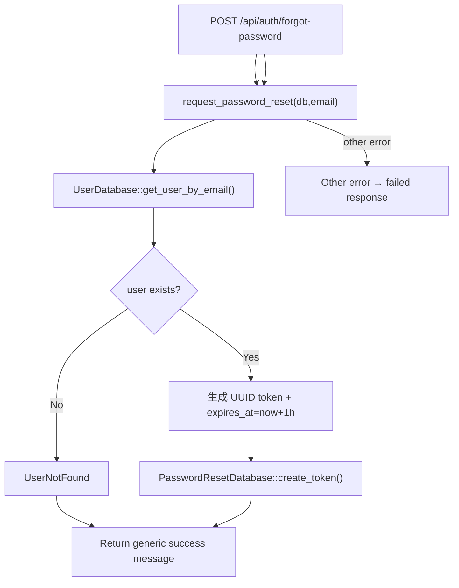

# Forgot Password

← [账号访问](/account/)

## What happens here?

handler 交给 `request_password_reset(email)`。service 按 email 查 user，生成 UUID reset token 与 1 小时过期时间，并写 password reset token。为了避免 email enumeration，handler 在 `UserNotFound` 时仍返回与成功相同的消息。

## ICFG

## State / Side Effects

- **DB READ:** user by email.
- **DB WRITE:** password reset token.

## Source Evidence

- Handler: [`crates/server/src/api/auth.rs:L166-L196`](https://github.com/burncloud/burncloud/blob/main/crates/server/src/api/auth.rs#L166-L196)
- Service: [`crates/service/crates/user/src/lib.rs:L383-L393`](https://github.com/burncloud/burncloud/blob/main/crates/service/crates/user/src/lib.rs#L383-L393)

**Confidence: HIGH — STATIC CONFIRMED**
