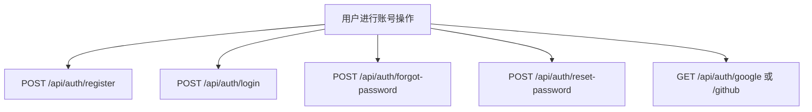

# 账号访问

← [BurnCloud Runtime Atlas](/)

## User Flow

这些 routes 在 `auth::public_routes()` 中注册，不经过 `/console/api/*` 的 JWT middleware。

## Source Evidence

- [`crates/server/src/api/auth.rs:L68-L90`](https://github.com/burncloud/burncloud/blob/main/crates/server/src/api/auth.rs#L68-L90)
