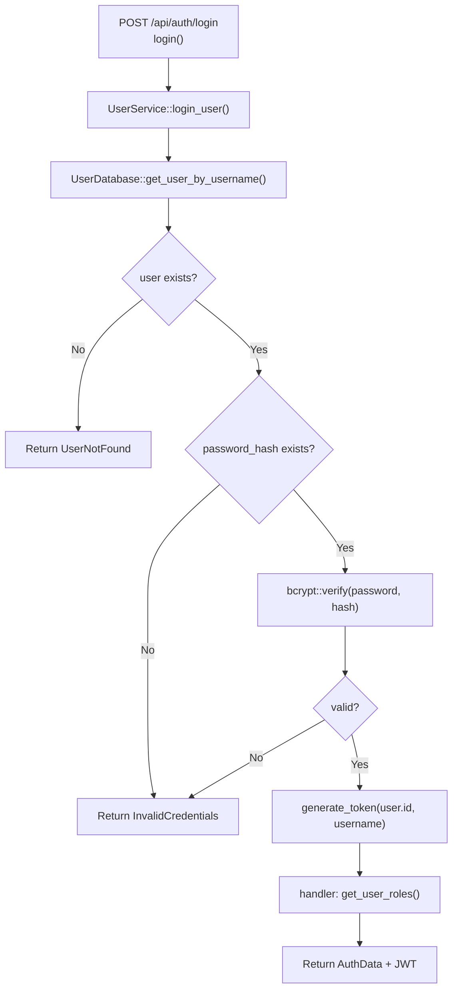

# Login Account

← [账号访问](/#/account/)

## What happens here?

登录读取用户记录并验证 bcrypt password hash；成功后生成 JWT，再由 handler 查询角色并返回认证数据。用户不存在和密码错误是两个明确 error path。

## ICFG

## Source Evidence

- Handler: [`crates/server/src/api/auth.rs:L131-L164`](https://github.com/burncloud/burncloud/blob/main/crates/server/src/api/auth.rs#L131-L164)
- Credential verification: [`crates/service/crates/user/src/lib.rs:L250-L310`](https://github.com/burncloud/burncloud/blob/main/crates/service/crates/user/src/lib.rs#L250-L310)

**Confidence: HIGH — STATIC CONFIRMED**
