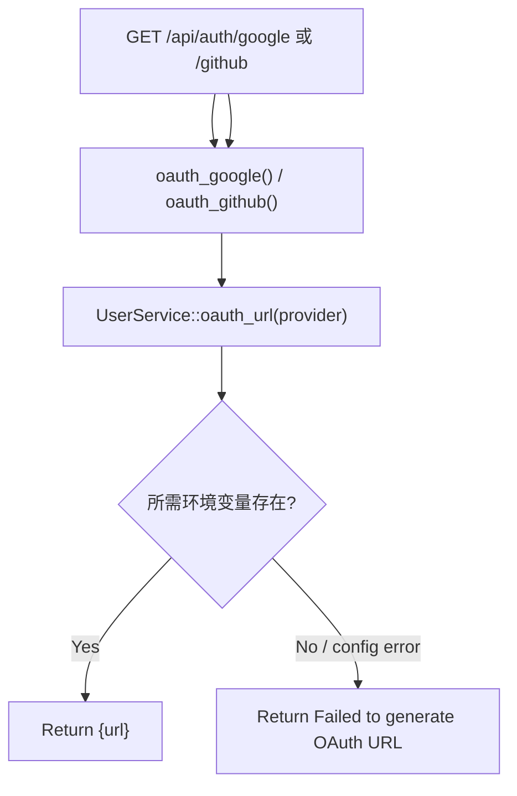

# OAuth URL Generation

← [账号访问](/account/)

## What happens here?

这两个 endpoint 当前只生成 OAuth authorization URL 并返回；本页不把后续 OAuth callback/login 流程补出来，因为在这组 route 中没有看到 callback handler。

## ICFG

## Static vs Runtime Truth

**STATIC CONFIRMED:** URL generation endpoint exists.  
**⚠ Unable to statically resolve from these routes:** complete OAuth callback/exchange lifecycle is not represented here and is not invented.

## Source Evidence

- [`crates/server/src/api/auth.rs:L221-L237`](https://github.com/burncloud/burncloud/blob/main/crates/server/src/api/auth.rs#L221-L237)
- [`crates/service/crates/user/src/lib.rs:L425-L470`](https://github.com/burncloud/burncloud/blob/main/crates/service/crates/user/src/lib.rs#L425-L470)
