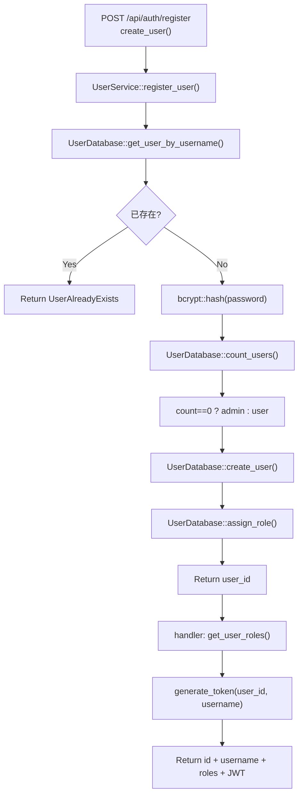

# Register Account

← [账号访问](/account/)

## What happens here?

注册 handler 调用 `UserService::register_user()`：先查 username 是否已存在，再 bcrypt hash 密码，构造新 user；在写用户前统计真实用户数决定首个用户是否为 admin，随后写 user 并尝试 assign role。handler 再读取 roles 并生成 JWT。

## ICFG

## State / Side Effects

- **DB READ:** username existence, user count.
- **DB WRITE:** user account, role assignment.
- Password hashing is local CPU work.

## Source Evidence

- Handler: [`crates/server/src/api/auth.rs:L91-L130`](https://github.com/burncloud/burncloud/blob/main/crates/server/src/api/auth.rs#L91-L130)
- Service control flow: [`crates/service/crates/user/src/lib.rs:L180-L238`](https://github.com/burncloud/burncloud/blob/main/crates/service/crates/user/src/lib.rs#L180-L238)

**Confidence: HIGH — STATIC CONFIRMED**
