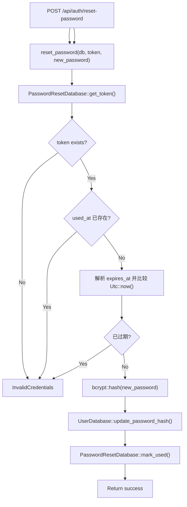

# Reset Password

← [账号访问](/account/)

## What happens here?

service 读取 reset token，拒绝已使用或过期 token；有效时 bcrypt hash 新密码，更新 user password hash，再把 reset token 标记 used。

## ICFG

## State / Side Effects

- **DB READ:** password reset token.
- **DB WRITE:** password hash + reset token used marker.

## Source Evidence

- Handler: [`crates/server/src/api/auth.rs:L198-L219`](https://github.com/burncloud/burncloud/blob/main/crates/server/src/api/auth.rs#L198-L219)
- Service: [`crates/service/crates/user/src/lib.rs:L395-L423`](https://github.com/burncloud/burncloud/blob/main/crates/service/crates/user/src/lib.rs#L395-L423)

**Confidence: HIGH — STATIC CONFIRMED**
