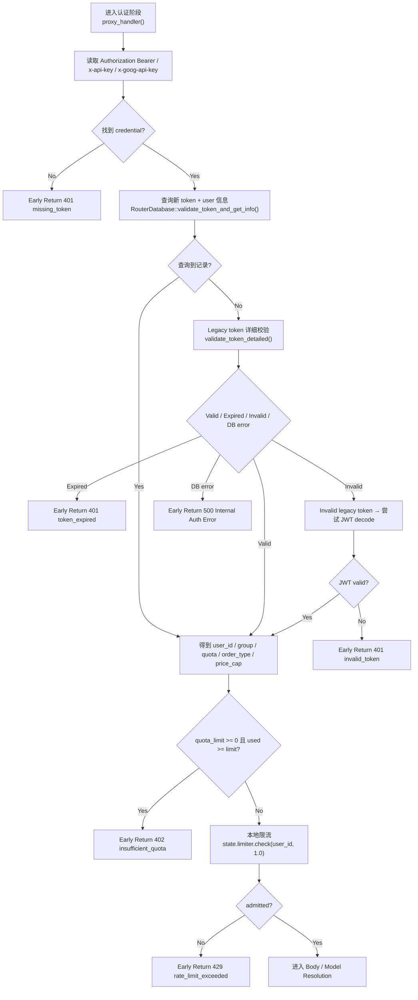

# Authentication & Admission

← [Chat Completion](/#/api-requests/chat-completion/)

## What happens here?

`proxy_handler()` 从三个 header 位置读取用户凭据，优先查询新 token/user 关联；找不到时再走 legacy token 校验，legacy 判 Invalid 时才尝试 JWT。成功得到 user/group/quota 后，还会执行 quota 上限检查和本地 rate limiter。

## Entry

- **Function:** `proxy_handler()`
- **Called From:** data-plane fallback

## ICFG

## State / Side Effects

- **DB READ:** token/user/quota/order routing context.
- **ASYNC DB WRITE:** successful DB-token paths spawn `update_token_accessed_time()`.
- **Local state:** rate limiter consumes one local admission unit when accepted.

## Decisions

- JWT is not the first credential path; it is a fallback after new/legacy token checks.
- quota and local rate-limit rejection happen before request body routing.

## Continue Drilling Down

→ [Model / Request Resolution](/#/api-requests/chat-completion/model-resolution/)

## Source Evidence

- [`crates/router/src/lib.rs:L1374-L1519`](https://github.com/burncloud/burncloud/blob/main/crates/router/src/lib.rs#L1374-L1519)
- [`crates/database/crates/router/src/lib.rs:L176-L227`](https://github.com/burncloud/burncloud/blob/main/crates/database/crates/router/src/lib.rs#L176-L227)

**Confidence: HIGH — STATIC CONFIRMED**
