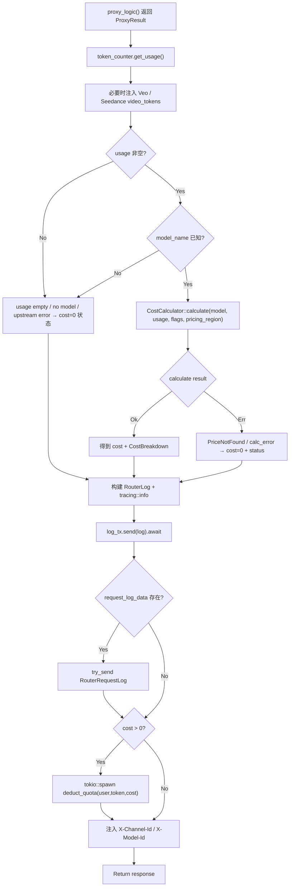

# Billing & Logging

← [Chat Completion](/api-requests/chat-completion/)

## What happens here?

`proxy_logic()` 返回后，`proxy_handler()` 从共享 `UnifiedTokenCounter` 读取 usage；Veo/Seedance 在 provider 没有 usage 时还会用请求字段补 video tokens。若 usage 非空且 model 已知，调用 `CostCalculator::calculate()`；随后写 RouterLog / optional request log，最后仅当 `cost > 0` 时异步执行 quota 扣减。

## ICFG

## State / Side Effects

- **Persistent log write:** background log consumer writes RouterLog.
- **Optional detailed request log:** async channel / try_send.
- **Quota mutation:** asynchronous only when `cost > 0`.
- **Metrics/counters:** missing-price and billing counters can mutate.

## Source Evidence

- Usage and cost: [`crates/router/src/lib.rs:L1754-L1816`](https://github.com/burncloud/burncloud/blob/main/crates/router/src/lib.rs#L1754-L1816)
- Log construction/enqueue: [`crates/router/src/lib.rs:L1823-L1946`](https://github.com/burncloud/burncloud/blob/main/crates/router/src/lib.rs#L1823-L1946)
- Quota deduction + response headers: [`crates/router/src/lib.rs:L1948-L1982`](https://github.com/burncloud/burncloud/blob/main/crates/router/src/lib.rs#L1948-L1982)

**Confidence: HIGH — STATIC CONFIRMED**
