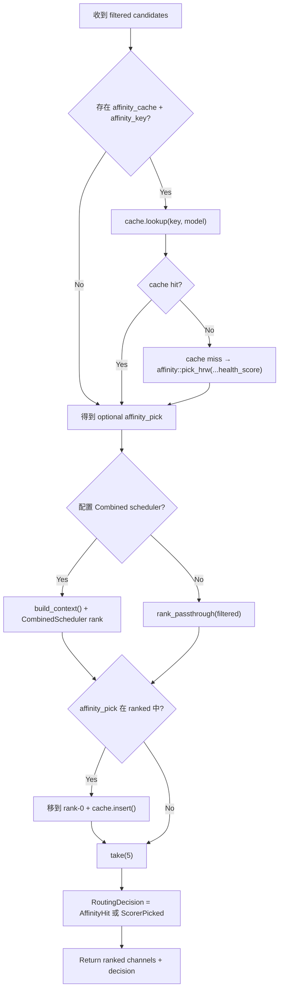

# Affinity & Ranking

← [Channel Selection](/api-requests/chat-completion/channel-selection/)

## What happens here?

过滤后的候选先尝试获取 affinity preference：有 cache hit 就使用；cache miss 时可用 HRW 依据 health score 产生 pick。候选仍然会被 scheduler 排名，最后如果 affinity pick 仍在 ranked 集合中，把它提升到首位并刷新 cache，然后只保留 top-5。

## ICFG

## State / Side Effects

- **READ/WRITE local cache:** Affinity cache lookup and refresh.
- Scheduler may read price/health context built from existing services; this page does not assume one concrete scheduler beyond the explicit `Combined` branch or passthrough rank branch.

## Continue Drilling Down

→ [Provider Execution](/api-requests/chat-completion/provider-execution/)

## Source Evidence

- [`crates/router/src/model_router.rs:L306-L368`](https://github.com/burncloud/burncloud/blob/main/crates/router/src/model_router.rs#L306-L368)

**Confidence: HIGH — STATIC CONFIRMED**
