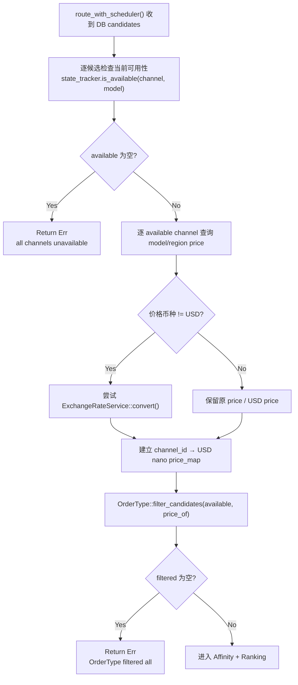

# Availability & OrderType Filtering

← [Channel Selection](/#/api-requests/chat-completion/channel-selection/)

## What happens here?

DB 候选先通过 `ChannelStateTracker::is_available()` 删除当前因 rate limit、auth failure 或 exhaustion 等状态不可用的 Channel。随后代码为剩余 Channel 读取 model/region price（非 USD 时尝试换算），再让 `OrderType::filter_candidates()` 应用预算/价格约束。

## ICFG

## Decisions

- Availability filtering occurs **before** price / OrderType filtering.
- Currency conversion failure logs a warning and falls back to raw amount; it does not abort selection.

## Continue Drilling Down

→ [Affinity + Ranking](/#/api-requests/chat-completion/channel-selection/affinity-ranking/)

## Source Evidence

- [`crates/router/src/model_router.rs:L248-L304`](https://github.com/burncloud/burncloud/blob/main/crates/router/src/model_router.rs#L248-L304)

**Confidence: HIGH — STATIC CONFIRMED**
