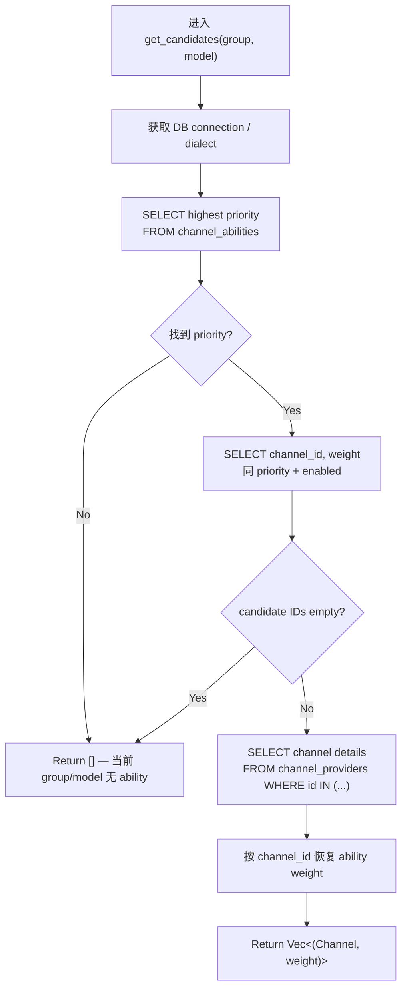

# Candidate Loading

← [Channel Selection](/api-requests/chat-completion/channel-selection/) · ← [Chat Completion](/api-requests/chat-completion/)

## What happens here?

`get_candidates(group, model)` 不直接扫描所有 Channel。它先从 `channel_abilities` 找当前 group+model 的**最高 priority**，再读取该 priority 下所有 enabled channel IDs/weights，最后批量从 `channel_providers` 取完整 Channel 配置并恢复 weight。

## ICFG

## State / Side Effects

- **DB READ:** `channel_abilities`, `channel_providers`.
- No DB writes in this function.

## Continue Drilling Down

→ [Availability + OrderType Filtering](/api-requests/chat-completion/channel-selection/availability-order-filter/)

## Source Evidence

- [`crates/router/src/model_router.rs:L84-L200`](https://github.com/burncloud/burncloud/blob/main/crates/router/src/model_router.rs#L84-L200)

**Confidence: HIGH — STATIC CONFIRMED**
