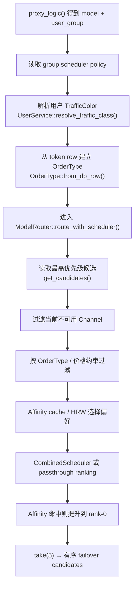

# Channel Selection — Overview

← [Chat Completion](/api-requests/chat-completion/)

## What happens here?

当请求可以解析出 model 时，`proxy_logic()` 读取 group 对应 scheduler policy、解析用户 traffic color 和 OrderType，然后调用 `ModelRouter::route_with_scheduler()`。后者从 DB 候选开始，依次做可用性、价格/OrderType、Affinity 与 Scheduler 排名，最多返回 5 个 failover 候选。

## ICFG — Selection Pipeline

## Decisions

- No candidate ability → returns empty vector; caller later returns no matching channel.
- All unavailable or OrderType removes all candidates → `NoAvailableChannelsError` and caller builds `503`.
- Affinity never removes failover alternatives; it only hoists a candidate before top-5.

## Continue Drilling Down

- → [Candidate Loading](/api-requests/chat-completion/channel-selection/candidate-loading/)
- → [Availability + OrderType Filtering](/api-requests/chat-completion/channel-selection/availability-order-filter/)
- → [Affinity + Ranking](/api-requests/chat-completion/channel-selection/affinity-ranking/)

## Source Evidence

- [`crates/router/src/lib.rs:L2077-L2264`](https://github.com/burncloud/burncloud/blob/main/crates/router/src/lib.rs#L2077-L2264)
- [`crates/router/src/model_router.rs:L202-L369`](https://github.com/burncloud/burncloud/blob/main/crates/router/src/model_router.rs#L202-L369)

**Confidence: HIGH — STATIC CONFIRMED**
