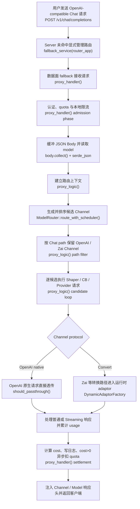

# Chat Completion — End-to-End

← [API 请求](/api-requests/)

## What happens here?

`POST /v1/chat/completions` 没有独立注册 handler；它先进入统一 Server，随后由数据面 `Router::fallback(proxy_handler)` 接收。`proxy_handler()` 完成凭据、quota、限流和 body/model 解析，再调用 `proxy_logic()`：后者恢复候选 Channel、按 `/v1/chat/completions` 的协议约束保留 OpenAI/Zai Channel、逐候选执行 Shaper/Circuit Breaker、原生透传或运行时 adaptor 转换，并在失败时尝试后续候选。返回 handler 后再完成 usage/cost、日志与异步 quota 扣减。

## Entry

- **User action:** `POST /v1/chat/completions`
- **HTTP binding:** data-plane fallback, not a dedicated Chat handler
- **Function:** `proxy_handler()`
- **Called From:** `Router::fallback(proxy_handler)`

## End-to-End Request Flow

## Decisions

- Missing / invalid credential can end the request before body routing.
- Exhausted quota → `402`; local rate limiter reject → `429`.
- For OpenAI-format paths including `/v1/chat/completions`, candidates whose `ChannelType` is not `OpenAI | Zai` are skipped before `Upstream` construction.
- OpenAI Channel + `/v1/chat/completions` is statically confirmed passthrough; conversion uses **⚠ Dynamic** adaptor resolution for the selected runtime ChannelType/API version.

## Continue Drilling Down

- → [请求进入系统](/api-requests/chat-completion/request-entry/)
- → [身份认证与准入](/api-requests/chat-completion/authentication-admission/)
- → [Model Resolution](/api-requests/chat-completion/model-resolution/)
- → [Channel Selection](/api-requests/chat-completion/channel-selection/)
- → [Provider Execution](/api-requests/chat-completion/provider-execution/)
- → [Streaming Response](/api-requests/chat-completion/streaming-response/)
- → [Billing & Logging](/api-requests/chat-completion/billing-settlement/)

## Source Evidence

- Server fallback composition: [`crates/server/src/lib.rs:L65-L89`](https://github.com/burncloud/burncloud/blob/main/crates/server/src/lib.rs#L65-L89)
- Data-plane explicit routes + fallback: [`crates/router/src/lib.rs:L954-L963`](https://github.com/burncloud/burncloud/blob/main/crates/router/src/lib.rs#L954-L963)
- `proxy_handler()`: [`crates/router/src/lib.rs:L1359-L1982`](https://github.com/burncloud/burncloud/blob/main/crates/router/src/lib.rs#L1359-L1982)
- Chat/OpenAI path channel filtering: [`crates/router/src/lib.rs:L2160-L2182`](https://github.com/burncloud/burncloud/blob/main/crates/router/src/lib.rs#L2160-L2182)
- Provider candidate loop: [`crates/router/src/lib.rs:L2369-L4167`](https://github.com/burncloud/burncloud/blob/main/crates/router/src/lib.rs#L2369-L4167)
- Passthrough decision: [`crates/router/src/passthrough.rs:L47-L87`](https://github.com/burncloud/burncloud/blob/main/crates/router/src/passthrough.rs#L47-L87)

**Confidence: HIGH — STATIC CONFIRMED.** Concrete conversion adaptor is runtime-selected and remains **DYNAMIC**.
