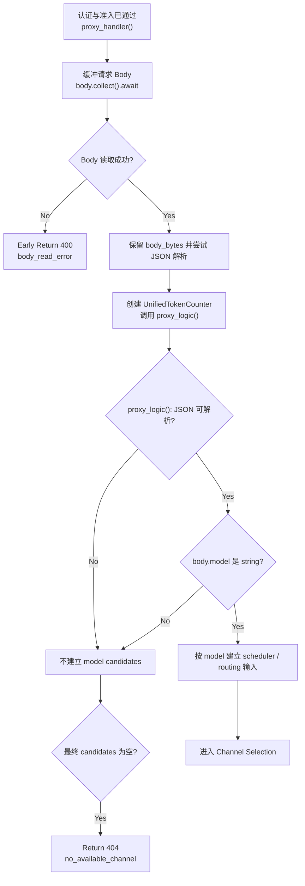

# Chat Model Resolution

← [Chat Completion](/#/api-requests/chat-completion/)

## What happens here?

认证通过后，`proxy_handler()` 把请求 body 完整缓冲为 bytes，再从 JSON 顶层读取 `model`。对 `POST /v1/chat/completions` 而言，后续 `proxy_logic()` 只有在 JSON 可解析且 `model` 为字符串时才能进入 model-based routing；否则候选列表保持为空，最终返回 `no_available_channel`。

## Entry

- **Route:** `POST /v1/chat/completions`（由 fallback 接收）
- **Function:** `proxy_handler()` → `proxy_logic()`
- **Input of interest:** request JSON `model`

## ICFG

## Decisions

- Body collection failure is an early `400` before `proxy_logic()`.
- `proxy_logic()` only enters model-based route recovery when JSON parses and `model` is a string.
- No model-derived candidates eventually reaches the explicit `candidates.is_empty()` response path.

## State / Side Effects

本阶段只构造 request-local bytes/JSON/model routing input；没有静态确认的 DB write。

## Continue Drilling Down

→ [Channel Selection](/#/api-requests/chat-completion/channel-selection/)

## Source Evidence

- Body buffering and model extraction in handler: [`crates/router/src/lib.rs:L1521-L1627`](https://github.com/burncloud/burncloud/blob/main/crates/router/src/lib.rs#L1521-L1627)
- `proxy_logic()` JSON/model gate and routing setup: [`crates/router/src/lib.rs:L2011-L2270`](https://github.com/burncloud/burncloud/blob/main/crates/router/src/lib.rs#L2011-L2270)
- Empty-candidate response: [`crates/router/src/lib.rs:L2272-L2295`](https://github.com/burncloud/burncloud/blob/main/crates/router/src/lib.rs#L2272-L2295)

**Confidence: HIGH — STATIC CONFIRMED.**
