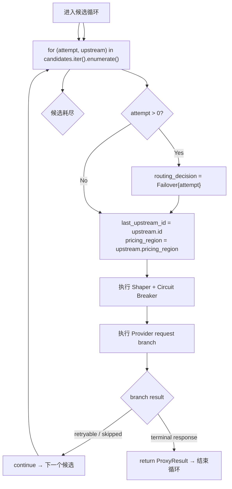

# Candidate Attempt Loop

← [Provider Execution](/api-requests/chat-completion/provider-execution/)

## What happens here?

每个候选对应一次 attempt。attempt>0 时 routing decision 被标记为 `Failover { attempt }`；当前候选的 `pricing_region` 也成为后续计费 region。循环中任何 `continue` 都意味着转到下一个 ranked candidate。

## ICFG

## Continue Drilling Down

→ [Shaper + Circuit Breaker](/api-requests/chat-completion/provider-execution/shaper-circuit-breaker/)

## Source Evidence

- [`crates/router/src/lib.rs:L2369-L2443`](https://github.com/burncloud/burncloud/blob/main/crates/router/src/lib.rs#L2369-L2443)
- End-of-loop terminal outcomes: [`crates/router/src/lib.rs:L4106-L4166`](https://github.com/burncloud/burncloud/blob/main/crates/router/src/lib.rs#L4106-L4166)

**Confidence: HIGH — STATIC CONFIRMED**
