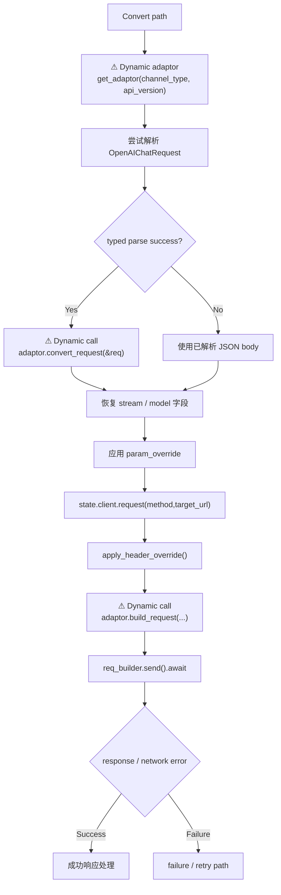

# Converted Provider Path

← [Provider Execution](/#/api-requests/chat-completion/provider-execution/)

## What happens here?

对 Chat Completion，前置 path filter 只保留 OpenAI/Zai，而 OpenAI Chat 会走 passthrough；因此当前用户流程中 Convert branch 对剩余可转换 candidate 进入 **⚠ Dynamic** `DynamicAdaptorFactory::get_adaptor()`。若 body 能解析为 `OpenAIChatRequest`，调用 adaptor 的 `convert_request()`；之后保留 stream/model 字段、应用 channel param/header override，再让 adaptor `build_request()` 构造真正 HTTP request 并发送。

## ICFG

## Dynamic / Unable to statically resolve

`convert_request()` 与 `build_request()` 的 concrete implementation 通过 runtime adaptor 调用。即使当前候选的 protocol/type 已知，Atlas 仍保留实际 factory dispatch 边界，不仅凭名称伪造 concrete method target。

## Continue Drilling Down

- → [Streaming Response](/#/api-requests/chat-completion/streaming-response/)
- → [Failure + Retry](/#/api-requests/chat-completion/provider-execution/failure-retry/)

## Source Evidence

- Chat path candidate type restriction: [`crates/router/src/lib.rs:L2160-L2182`](https://github.com/burncloud/burncloud/blob/main/crates/router/src/lib.rs#L2160-L2182)
- Convert path: [`crates/router/src/lib.rs:L3067-L3159`](https://github.com/burncloud/burncloud/blob/main/crates/router/src/lib.rs#L3067-L3159)

**Confidence: HIGH for control flow; DYNAMIC for adaptor implementation.**
