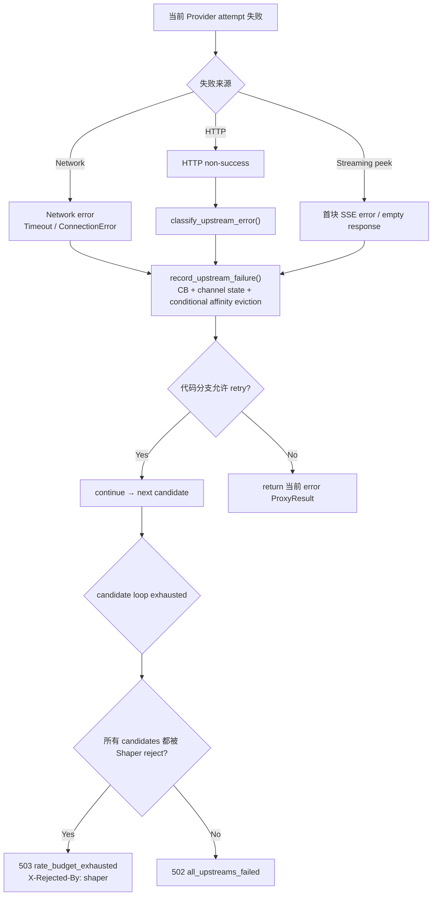

# Failure & Retry

← [Provider Execution](/api-requests/chat-completion/provider-execution/)

## What happens here?

Provider 失败不是统一“返回错误”。代码会先分类 failure 并更新 Circuit Breaker / ChannelStateTracker；部分 health failures 还会 evict affinity。5xx、network error、429，以及 passthrough 中的 401/402 都有明确的继续下一个 candidate 分支；其他 4xx 通常直接形成终止 `ProxyResult`。候选耗尽后根据“是否全部被 Shaper 拒绝”返回 503 或 502。

## ICFG

## Decisions

- `record_upstream_failure()` evicts affinity only for ServerError / Timeout / ConnectionError / EmptyResponse.
- HTTP 429 explicitly retries next candidate in converted path.
- Passthrough explicitly retries 429 / 401 / 402.
- API-version deprecation can spawn async detector/update, but that does not make the current 4xx retryable by itself.

## State / Side Effects

- Circuit breaker mutation.
- Channel state error mutation.
- Conditional affinity cache eviction.
- Failover history appended when detailed logging is active.

## Source Evidence

- Failure state semantics: [`crates/router/src/lib.rs:L304-L366`](https://github.com/burncloud/burncloud/blob/main/crates/router/src/lib.rs#L304-L366)
- Error classification: [`crates/router/src/lib.rs:L414-L439`](https://github.com/burncloud/burncloud/blob/main/crates/router/src/lib.rs#L414-L439)
- Passthrough retry/error branches: [`crates/router/src/lib.rs:L2561-L3064`](https://github.com/burncloud/burncloud/blob/main/crates/router/src/lib.rs#L2561-L3064)
- Converted retry/error branches and terminal outcomes: [`crates/router/src/lib.rs:L3158-L4166`](https://github.com/burncloud/burncloud/blob/main/crates/router/src/lib.rs#L3158-L4166)

**Confidence: HIGH — STATIC CONFIRMED**
