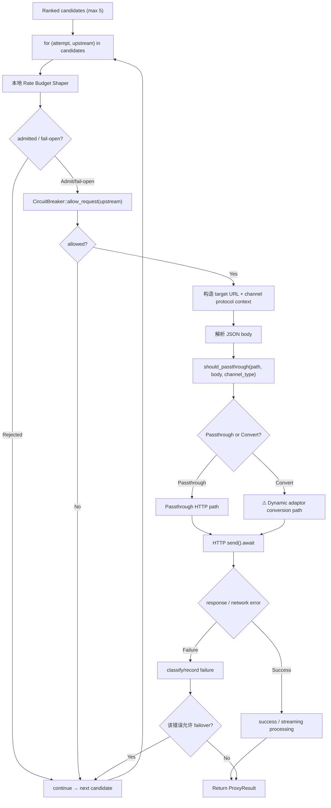

# Provider Execution — Overview

← [Chat Completion](/#/api-requests/chat-completion/) · ← [Channel Selection](/#/api-requests/chat-completion/channel-selection/)

## What happens here?

`proxy_logic()` 对已排序候选逐个尝试。每次 attempt 先处理本地 Rate Budget Shaper，再检查 Circuit Breaker；之后根据 channel protocol 选择 passthrough 或 conversion 路径，真正执行 `reqwest::RequestBuilder::send().await`。失败是否继续下一个候选由具体错误类型和分支决定。

## ICFG — Candidate Attempt

## Dynamic Boundary

`DynamicAdaptorFactory::get_adaptor(channel_type, api_version)` 返回具体 adaptor；该实现由运行时 channel type / API version 决定。**⚠ Dynamic — 不把某一 Provider 实现画成所有请求固定目标。**

## Continue Drilling Down

- → [Candidate Attempt Loop](/#/api-requests/chat-completion/provider-execution/candidate-attempt-loop/)
- → [Shaper + Circuit Breaker](/#/api-requests/chat-completion/provider-execution/shaper-circuit-breaker/)
- → [Protocol Dispatch](/#/api-requests/chat-completion/provider-execution/protocol-dispatch/)
- → [Passthrough Path](/#/api-requests/chat-completion/provider-execution/passthrough/)
- → [Conversion Path](/#/api-requests/chat-completion/provider-execution/conversion/)
- → [Failure + Retry](/#/api-requests/chat-completion/provider-execution/failure-retry/)

## Source Evidence

- [`crates/router/src/lib.rs:L2336-L4167`](https://github.com/burncloud/burncloud/blob/main/crates/router/src/lib.rs#L2336-L4167)

**Confidence: HIGH for loop/branches; DYNAMIC for concrete adaptor implementation.**
