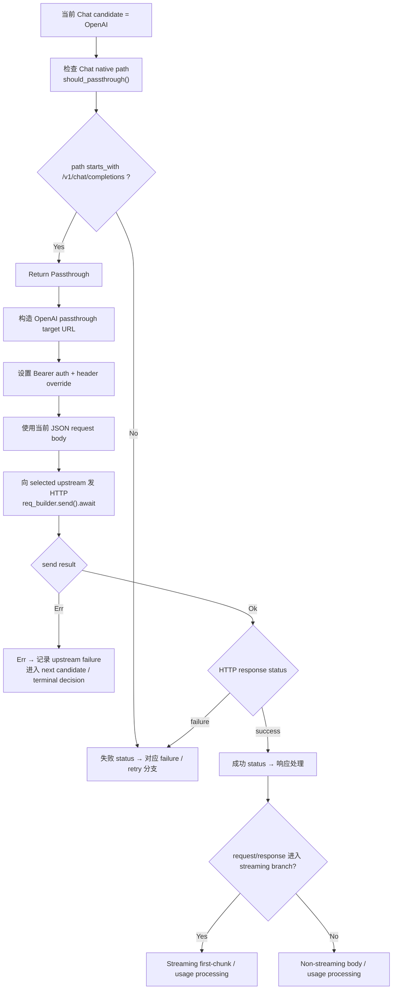

# OpenAI Chat Passthrough

← [Provider Execution](/#/api-requests/chat-completion/provider-execution/) · ← [Chat Completion](/#/api-requests/chat-completion/)

## What happens here?

对当前 `POST /v1/chat/completions` 用户流程，候选在前一阶段已经限制为 OpenAI/Zai。`should_passthrough()` 对 `ChannelType::OpenAI` + Chat path 明确返回 `Passthrough`；随后代码使用 OpenAI upstream base URL/auth context 构造请求并执行 `reqwest::send().await`。成功后再按 request/response 是否 streaming 进入对应响应处理；网络或 HTTP failure 进入 failover 判断。

## Entry

- **Condition:** selected candidate maps to `ChannelType::OpenAI`
- **Path:** `/v1/chat/completions`
- **Decision:** `should_passthrough(...) == PassthroughDecision::Passthrough`

## ICFG

## Decisions

- `ChannelType::OpenAI` + `/v1/chat/completions` is a statically confirmed native passthrough decision.
- This page intentionally does **not** show Anthropic/Gemini passthrough paths because they are not part of this Chat Completion execution branch after the path/channel filter.

## State / Side Effects

- **External HTTP:** request to the selected OpenAI upstream.
- Success/failure can update circuit/channel health state in later shared handling.
- Streaming/non-streaming response processing can update `UnifiedTokenCounter`.

## Continue Drilling Down

- → [Streaming Response](/#/api-requests/chat-completion/streaming-response/)
- → [Failure + Retry](/#/api-requests/chat-completion/provider-execution/failure-retry/)

## Source Evidence

- Chat path candidate type restriction: [`crates/router/src/lib.rs:L2160-L2182`](https://github.com/burncloud/burncloud/blob/main/crates/router/src/lib.rs#L2160-L2182)
- OpenAI Chat passthrough decision: [`crates/router/src/passthrough.rs:L63-L70`](https://github.com/burncloud/burncloud/blob/main/crates/router/src/passthrough.rs#L63-L70)
- Passthrough execution region: [`crates/router/src/lib.rs:L2482-L3064`](https://github.com/burncloud/burncloud/blob/main/crates/router/src/lib.rs#L2482-L3064)

**Confidence: HIGH — STATIC CONFIRMED.**
