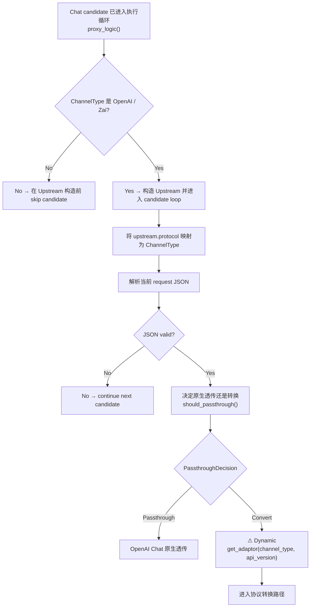

# Chat Protocol Dispatch

← [Provider Execution](/#/api-requests/chat-completion/provider-execution/) · ← [Chat Completion](/#/api-requests/chat-completion/)

## What happens here?

对 `/v1/chat/completions`，`proxy_logic()` 在创建 `Upstream` 前已经跳过非 `OpenAI | Zai` Channel。进入候选执行后，当前 upstream protocol 被映射成 `ChannelType` 并交给 `should_passthrough()`：OpenAI Channel 对 Chat path 明确走原生透传；需要 Convert 的路径再通过 `DynamicAdaptorFactory` 按运行时 ChannelType/API version 获取 adaptor，因此 concrete adaptor 不能静态固定。

## ICFG

## Decisions

- `/v1/chat/completions` is an OpenAI-format path, so non-OpenAI/Zai channels are skipped before `Upstream` construction.
- OpenAI Channel + `/v1/chat/completions` → `PassthroughDecision::Passthrough`.
- Other selected protocol paths that reach Convert → **⚠ Dynamic** adaptor lookup; this Atlas does not invent the concrete implementation.

## Continue Drilling Down

- → [Passthrough Path](/#/api-requests/chat-completion/provider-execution/passthrough/)
- → [Conversion Path](/#/api-requests/chat-completion/provider-execution/conversion/)

## Source Evidence

- Chat/OpenAI path candidate filter: [`crates/router/src/lib.rs:L2160-L2182`](https://github.com/burncloud/burncloud/blob/main/crates/router/src/lib.rs#L2160-L2182)
- Passthrough decision: [`crates/router/src/passthrough.rs:L47-L87`](https://github.com/burncloud/burncloud/blob/main/crates/router/src/passthrough.rs#L47-L87)
- Dynamic adaptor lookup: [`crates/router/src/lib.rs:L3067-L3071`](https://github.com/burncloud/burncloud/blob/main/crates/router/src/lib.rs#L3067-L3071)

**Confidence: HIGH for static branch selection; DYNAMIC for the concrete conversion adaptor.**
