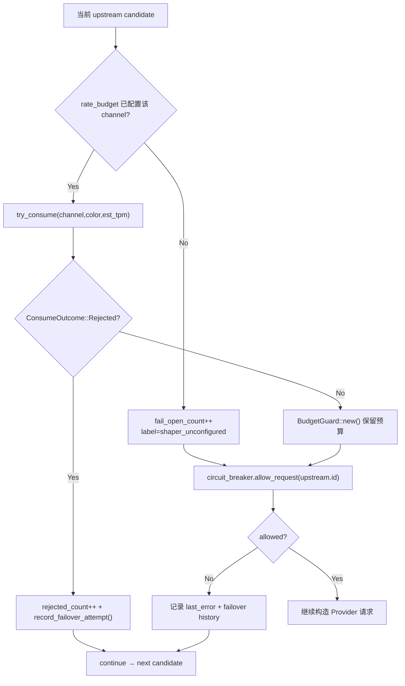

# Shaper & Circuit Breaker

← [Provider Execution](/#/api-requests/chat-completion/provider-execution/)

## What happens here?

每个候选在真正发 HTTP 之前先经过本地 Rate Budget Shaper，然后才检查 Circuit Breaker。未配置 Shaper 的 Channel fail-open；配置了但 `try_consume` 返回 `Rejected` 时记录 failover 并直接跳下一个候选。Circuit Breaker open 同样直接 skip，且预留的 BudgetGuard 通过 Drop 退款。

## ICFG

## State / Side Effects

- `fail_open_count` increments for unconfigured Shaper channels.
- `shaper_ctx.rejected_count` tracks local rejections for final all-rejected `503` decision.
- Circuit Breaker state is read here; failure/success mutation happens later.

## Continue Drilling Down

→ [Protocol Dispatch](/#/api-requests/chat-completion/provider-execution/protocol-dispatch/)

## Source Evidence

- [`crates/router/src/lib.rs:L2381-L2443`](https://github.com/burncloud/burncloud/blob/main/crates/router/src/lib.rs#L2381-L2443)

**Confidence: HIGH — STATIC CONFIRMED**
