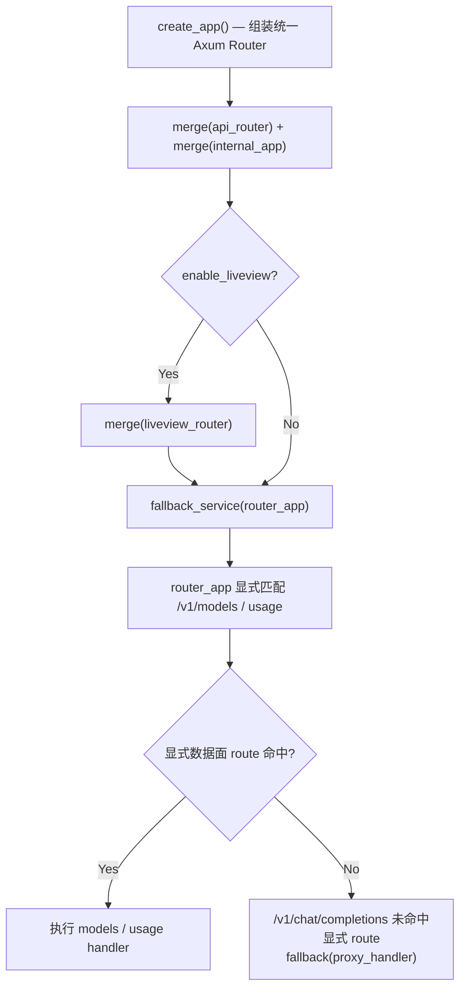

# Request Entry

← [Chat Completion](/api-requests/chat-completion/)

## What happens here?

本页只回答“`POST /v1/chat/completions` 为什么会到 `proxy_handler()`”。Server 先合并 Management API、internal routes 和可选 LiveView；未命中的请求交给 `router_app`。在 `router_app` 内，只有 models / usage 是显式路由，`/v1/chat/completions` 不属于这些显式 route，因此进入 `fallback(proxy_handler)`。

## Entry

- **Function:** `server::create_app()`
- **Next:** `router::create_router_app()` → `proxy_handler()`

## ICFG

## Decisions

- `enable_liveview` only affects whether LiveView routes are merged; it does not remove the data-plane fallback.
- `router_app` explicitly intercepts models / usage before the fallback.

## Continue Drilling Down

→ [Authentication & Admission](/api-requests/chat-completion/authentication-admission/)

## Source Evidence

- [`crates/server/src/lib.rs:L31-L91`](https://github.com/burncloud/burncloud/blob/main/crates/server/src/lib.rs#L31-L91)
- [`crates/router/src/lib.rs:L944-L965`](https://github.com/burncloud/burncloud/blob/main/crates/router/src/lib.rs#L944-L965)

**Confidence: HIGH — STATIC CONFIRMED**
