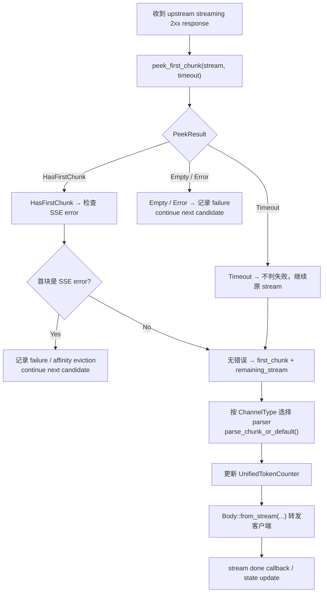

# Streaming Response

← [Chat Completion](/#/api-requests/chat-completion/) · ← [Provider Execution](/#/api-requests/chat-completion/provider-execution/)

## What happens here?

Streaming 成功状态不会立即视为最终 success。代码先 peek 第一块，若首块直接暴露 SSE error、空响应或读取错误，则在 HTTP response 交给 client 前把当前候选标成失败并 failover。通过 peek 后，流一边转发给 client，一边解析 usage/content；结束时再决定是否记录 success 或 empty-response penalty。

## ICFG

## Dynamic Boundary

具体 stream parser 由 `channel_type` 决定。**⚠ Dynamic**，本页只确认 parser selection + shared token counter behavior。

## State / Side Effects

- `UnifiedTokenCounter` accumulates/set usage.
- Circuit breaker/channel state/affinity can mutate on stream failure/success.
- Response body is streamed to client instead of fully buffered.

## Continue Drilling Down

→ [Billing & Logging](/#/api-requests/chat-completion/billing-settlement/)

## Source Evidence

- OpenAI converted streaming branch: [`crates/router/src/lib.rs:L3287-L3420`](https://github.com/burncloud/burncloud/blob/main/crates/router/src/lib.rs#L3287-L3420)
- Passthrough streaming branch: [`crates/router/src/lib.rs:L2606-L2785`](https://github.com/burncloud/burncloud/blob/main/crates/router/src/lib.rs#L2606-L2785)

**Confidence: HIGH for shared control flow; DYNAMIC for concrete parser.**
