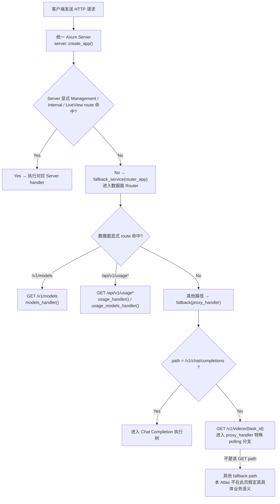

# API 请求

← [BurnCloud Runtime Atlas](/)

## What happens here?

BurnCloud 的数据面 Router 只有三个显式 route：`GET /v1/models`、`GET /api/v1/usage`、`GET /api/v1/usage/models`；其余数据面路径进入 `Router::fallback(proxy_handler)`。本 Atlas 把最重要的用户动作 `POST /v1/chat/completions` 独立展开，并把 `GET /v1/videos/{task_id}` 的特殊 polling 分支作为另一个用户流程。

## End-to-End Entry Split

## Continue Drilling Down

- → [Chat Completion](/#/api-requests/chat-completion/)
- → [Video Task Polling](/#/api-requests/video-task-polling/)
- → [Query Models](/#/api-requests/models/)
- → [Query API Usage](/#/api-requests/usage/)

## Source Evidence

- Server composition and fallback: [`crates/server/src/lib.rs:L31-L91`](https://github.com/burncloud/burncloud/blob/main/crates/server/src/lib.rs#L31-L91)
- Data-plane explicit routes and fallback: [`crates/router/src/lib.rs:L937-L965`](https://github.com/burncloud/burncloud/blob/main/crates/router/src/lib.rs#L937-L965)
- Video polling branch: [`crates/router/src/lib.rs:L1626-L1707`](https://github.com/burncloud/burncloud/blob/main/crates/router/src/lib.rs#L1626-L1707)

**Confidence: HIGH — STATIC CONFIRMED.** The `OTHER` branch is intentionally not assigned a business flow on this page.
