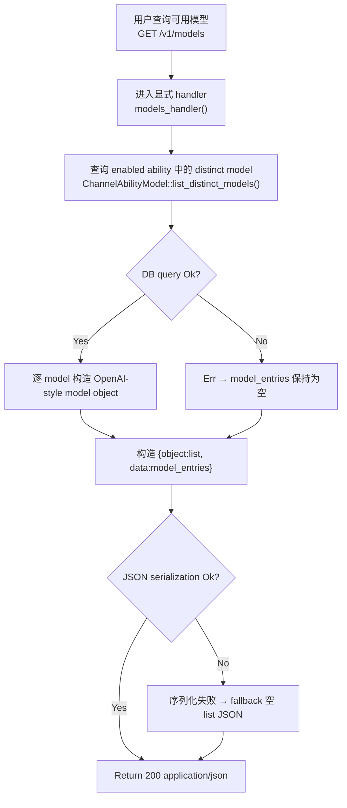

# Query Models

← [API 请求](/#/api-requests/)

## What happens here?

`GET /v1/models` 是数据面 Router 的显式 route，不进入 `proxy_handler()`。`models_handler()` 调用 `ChannelAbilityModel::list_distinct_models()`，从 `channel_abilities` 查询 `enabled = 1` 的 distinct model；查询成功时把每个 model 转成 OpenAI-style model object。需要注意：当前 handler 对 DB 查询失败使用 `if let Ok(...)`，因此失败不会返回 5xx，而是继续返回空 `data` 列表。

## ICFG

## State / Side Effects

- **DB READ:** `channel_abilities.model` where `enabled = 1`.
- No DB/cache mutation is visible on this path.

## Source Evidence

- Route registration: [`crates/router/src/lib.rs:L954-L960`](https://github.com/burncloud/burncloud/blob/main/crates/router/src/lib.rs#L954-L960)
- Handler: [`crates/router/src/lib.rs:L1041-L1080`](https://github.com/burncloud/burncloud/blob/main/crates/router/src/lib.rs#L1041-L1080)
- DB query: [`crates/database/crates/channel/src/channel_ability.rs:L116-L128`](https://github.com/burncloud/burncloud/blob/main/crates/database/crates/channel/src/channel_ability.rs#L116-L128)

**Confidence: HIGH — STATIC CONFIRMED.**
