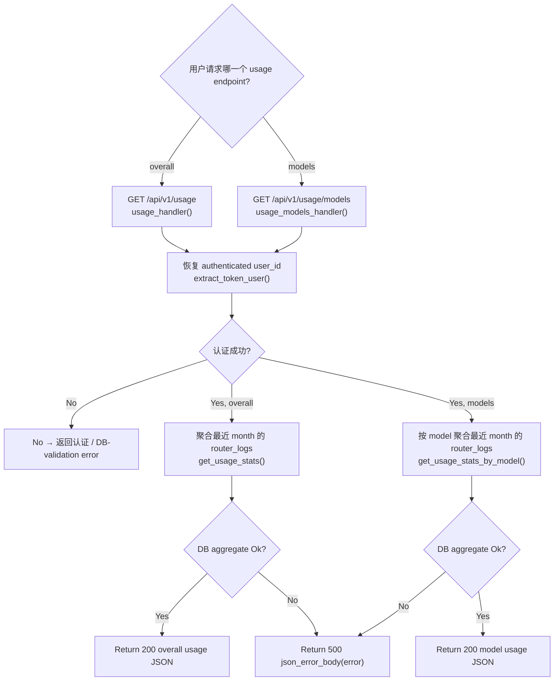

# Query API Usage

← [API 请求](/#/api-requests/)

## What happens here?

两个 usage endpoint 都是显式数据面 GET routes。它们先通过共享 `extract_token_user()` 从 Bearer token 恢复 user id：新 token/user lookup → legacy token → JWT fallback；认证失败可在 DB 查询前退出。认证成功后，overall path 从 `router_logs` 聚合当前用户最近一个月的 request/token/cost；models path 使用同一时间窗口按 model 分组。

## ICFG

## State / Side Effects

- **DB READ:** token/user tables during auth; `router_logs` during usage aggregation.
- No usage state mutation is visible in these handlers.

## Source Evidence

- Route registration: [`crates/router/src/lib.rs:L954-L960`](https://github.com/burncloud/burncloud/blob/main/crates/router/src/lib.rs#L954-L960)
- Token/JWT recovery helper: [`crates/router/src/lib.rs:L1082-L1136`](https://github.com/burncloud/burncloud/blob/main/crates/router/src/lib.rs#L1082-L1136)
- Usage handlers: [`crates/router/src/lib.rs:L1138-L1201`](https://github.com/burncloud/burncloud/blob/main/crates/router/src/lib.rs#L1138-L1201)
- Overall SQL aggregate: [`crates/database/crates/router/src/log.rs:L283-L339`](https://github.com/burncloud/burncloud/blob/main/crates/database/crates/router/src/log.rs#L283-L339)
- By-model SQL aggregate: [`crates/database/crates/router/src/log.rs:L341-L390`](https://github.com/burncloud/burncloud/blob/main/crates/database/crates/router/src/log.rs#L341-L390)

**Confidence: HIGH — STATIC CONFIRMED.**
