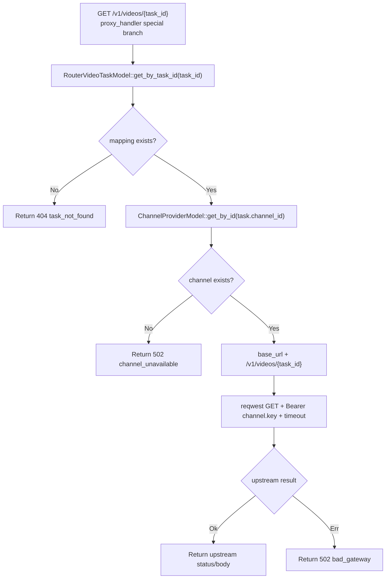

# Video Task Polling

← [API 请求](/api-requests/)

## What happens here?

`GET /v1/videos/{task_id}` 在正常 `proxy_logic()` 之前被特殊处理，因为它没有 model 可重新选路。系统读取创建视频任务时保存的 task→channel mapping，再读取该 Channel 的 base URL/key，直接对原 Channel 发 GET。

## ICFG

## State / Side Effects

- **DB READ:** video task mapping + channel config.
- **External HTTP GET:** selected historical channel.
- No normal ModelRouter re-selection on this branch.

## Source Evidence

- [`crates/router/src/lib.rs:L1626-L1707`](https://github.com/burncloud/burncloud/blob/main/crates/router/src/lib.rs#L1626-L1707)

**Confidence: HIGH — STATIC CONFIRMED**
