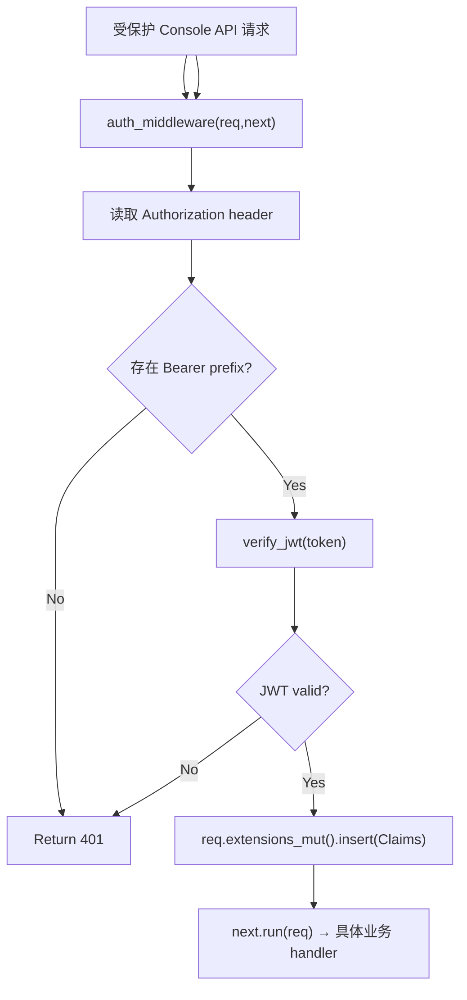

# Protected Console Authentication

← [Console 管理](/console/)

## What happens here?

所有合并到 protected router 的管理 API 先经过 `auth_middleware()`。middleware 只接受 `Authorization: Bearer ...`，调用 `verify_jwt()`；成功后把 `Claims` 注入 request extensions，再执行真正 handler。

## ICFG

## State / Side Effects

- Request-local mutation: inject `Claims` extension.
- No DB query in this middleware; JWT is decoded with secret.

## Source Evidence

- Protected middleware composition: [`crates/server/src/api/mod.rs:L18-L55`](https://github.com/burncloud/burncloud/blob/main/crates/server/src/api/mod.rs#L18-L55)
- Middleware: [`crates/server/src/api/auth.rs:L239-L265`](https://github.com/burncloud/burncloud/blob/main/crates/server/src/api/auth.rs#L239-L265)

**Confidence: HIGH — STATIC CONFIRMED**
