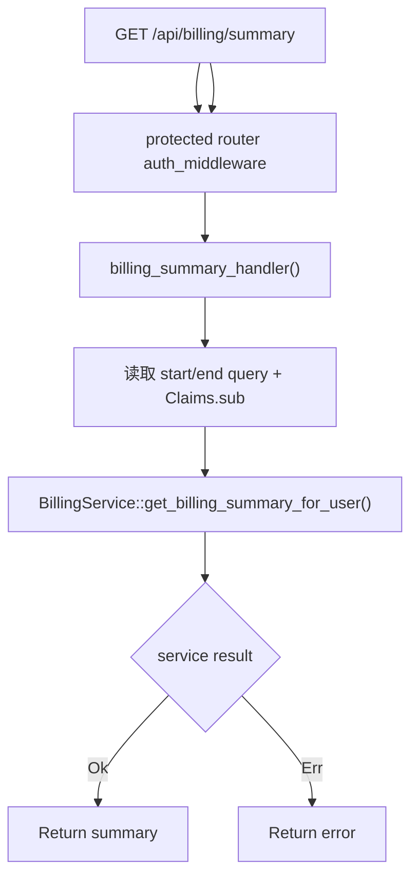

# View Billing Summary

← [Console 管理](/console/)

## What happens here?

虽然 path 是 `/api/billing/summary`，`billing::routes()` 被 merge 到 protected router，因此当前组合会先有 JWT Claims，再调用 `BillingService::get_billing_summary_for_user()`，按 `claims.sub` 限定当前用户并可选 start/end。

## ICFG

## Source Evidence

- [`crates/server/src/api/billing.rs:L25-L45`](https://github.com/burncloud/burncloud/blob/main/crates/server/src/api/billing.rs#L25-L45)
- Protected merge: [`crates/server/src/api/mod.rs:L18-L55`](https://github.com/burncloud/burncloud/blob/main/crates/server/src/api/mod.rs#L18-L55)
