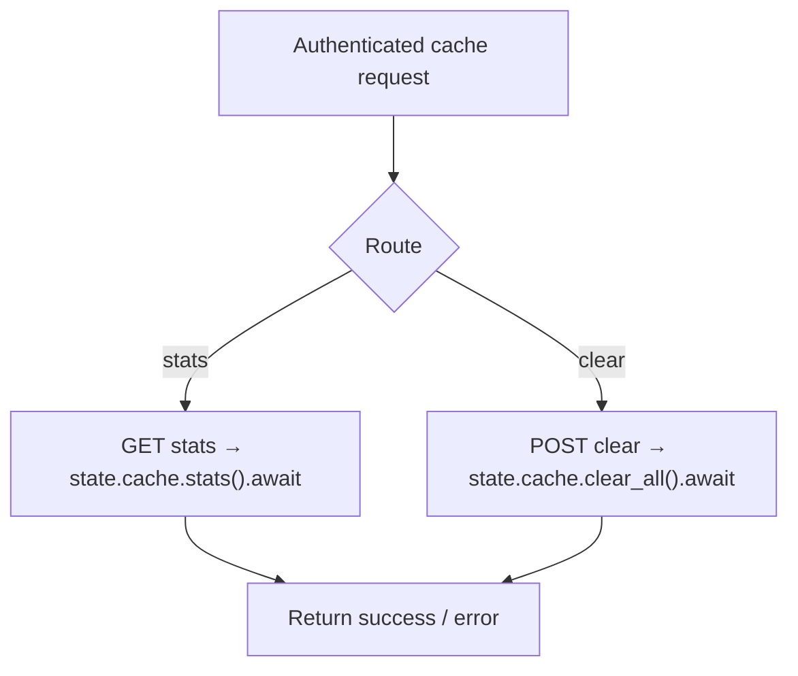

# Cache Stats & Clear

← [Console 管理](/#/console/)

## ICFG

## State / Side Effects

- stats: cache read/inspection.
- clear: cache mutation (`clear_all`).
- Cache service may be disabled when REDIS_URL is absent; that runtime availability is initialized in `create_app()`.

## Source Evidence

- [`crates/server/src/api/cache.rs:L11-L33`](https://github.com/burncloud/burncloud/blob/main/crates/server/src/api/cache.rs#L11-L33)
- Cache initialization: [`crates/server/src/lib.rs:L37-L43`](https://github.com/burncloud/burncloud/blob/main/crates/server/src/lib.rs#L37-L43)
