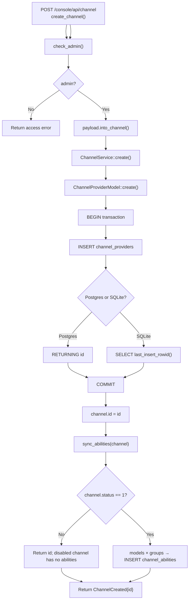

# Create Channel

← [Channel Management](/console/channel-management/)

## What happens here?

admin handler 把 `ChannelDto` 转成 `Channel` 后调用 service。DB 层在 transaction 中插入 `channel_providers` 并得到新 ID，commit 后立即调用 `sync_abilities()`：删除旧 abilities（新记录通常没有），若 channel enabled，则按 `models × groups` 写入 `channel_abilities`。

## ICFG

## State / Side Effects

- DB WRITE: `channel_providers`.
- DB WRITE: `channel_abilities` generated from channel models/groups when enabled.

## Source Evidence

- Handler: [`crates/server/src/api/channel.rs:L161-L176`](https://github.com/burncloud/burncloud/blob/main/crates/server/src/api/channel.rs#L161-L176)
- DB create: [`crates/database/crates/channel/src/channel_provider.rs:L9-L87`](https://github.com/burncloud/burncloud/blob/main/crates/database/crates/channel/src/channel_provider.rs#L9-L87)
- Ability sync: [`crates/database/crates/channel/src/channel_provider.rs:L236-L310`](https://github.com/burncloud/burncloud/blob/main/crates/database/crates/channel/src/channel_provider.rs#L236-L310)

**Confidence: HIGH — STATIC CONFIRMED**
