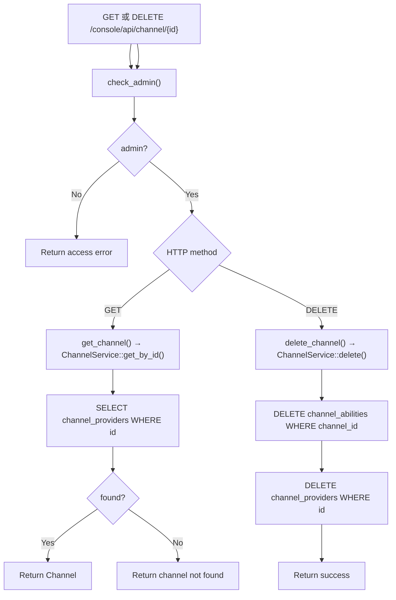

# Get / Delete Channel

← [Channel Management](/#/console/channel-management/)

## ICFG

## State / Side Effects

- GET: DB read only.
- DELETE: removes abilities first, then provider row.

## Source Evidence

- Handlers: [`crates/server/src/api/channel.rs:L198-L227`](https://github.com/burncloud/burncloud/blob/main/crates/server/src/api/channel.rs#L198-L227)
- DB get/delete: [`crates/database/crates/channel/src/channel_provider.rs:L136-L192`](https://github.com/burncloud/burncloud/blob/main/crates/database/crates/channel/src/channel_provider.rs#L136-L192)
