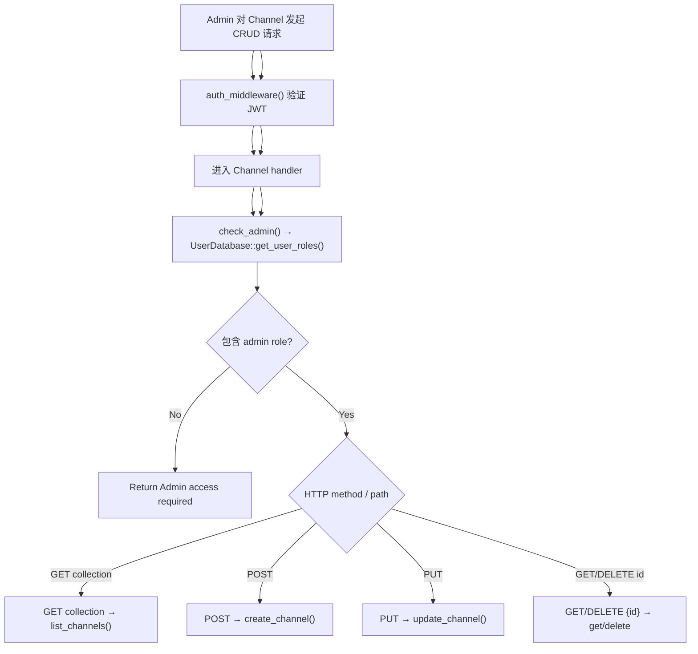

# Channel Management

← [Console 管理](/console/)

## What happens here?

同一 `/console/api/channel` route 根据 HTTP method 分派 list/create/update，`/console/api/channel/{id}` 分派 get/delete。所有操作先经过 Console JWT middleware；Channel handlers 再调用 `check_admin()` 查询用户 roles，只有 admin 才进入 `ChannelService`。

## End-to-End Flow

## Source Evidence

- Route bindings + admin check: [`crates/server/src/api/channel.rs:L111-L137`](https://github.com/burncloud/burncloud/blob/main/crates/server/src/api/channel.rs#L111-L137)
