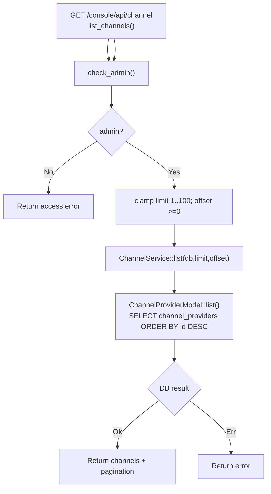

# List Channels

← [Channel Management](/console/channel-management/)

## ICFG

## State / Side Effects

- DB READ only.

## Source Evidence

- [`crates/server/src/api/channel.rs:L139-L159`](https://github.com/burncloud/burncloud/blob/main/crates/server/src/api/channel.rs#L139-L159)
- [`crates/service/crates/channel/src/lib.rs:L17-L20`](https://github.com/burncloud/burncloud/blob/main/crates/service/crates/channel/src/lib.rs#L17-L20)
- [`crates/database/crates/channel/src/channel_provider.rs:L194-L234`](https://github.com/burncloud/burncloud/blob/main/crates/database/crates/channel/src/channel_provider.rs#L194-L234)
