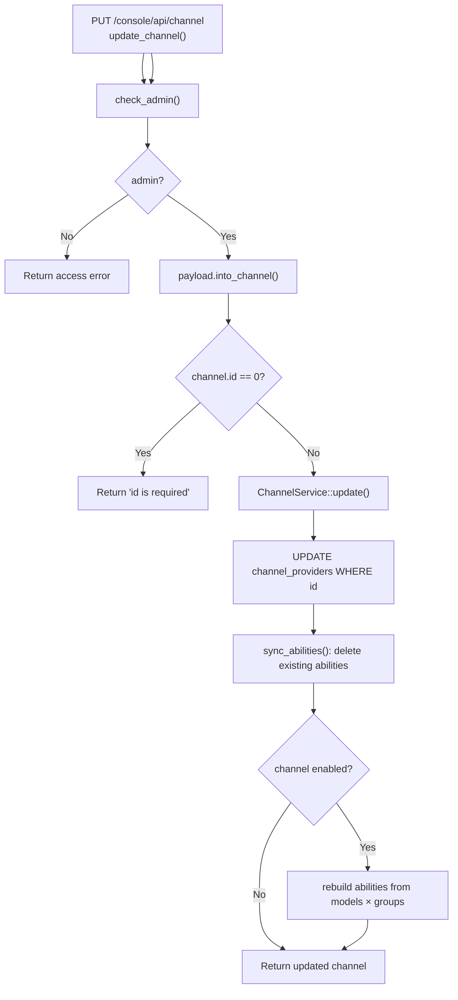

# Update Channel

← [Channel Management](/console/channel-management/)

## ICFG

## State / Side Effects

- DB WRITE: update provider row.
- DB WRITE: delete/rebuild channel abilities.

## Source Evidence

- [`crates/server/src/api/channel.rs:L178-L196`](https://github.com/burncloud/burncloud/blob/main/crates/server/src/api/channel.rs#L178-L196)
- [`crates/database/crates/channel/src/channel_provider.rs:L89-L134`](https://github.com/burncloud/burncloud/blob/main/crates/database/crates/channel/src/channel_provider.rs#L89-L134)
- [`crates/database/crates/channel/src/channel_provider.rs:L236-L310`](https://github.com/burncloud/burncloud/blob/main/crates/database/crates/channel/src/channel_provider.rs#L236-L310)
