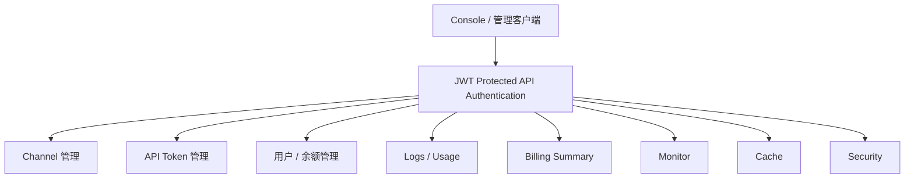

# Console 管理

← [BurnCloud Runtime Atlas](/)

## What happens here?

`api::routes()` 把 auth public routes 与受保护的 Console routes 分开。Channel、Token、Log、Monitor、User、Security、Billing、Cache 等 routes 合并后统一套 `auth_middleware`；其中 Channel handler 还会额外执行 admin role 检查。

## User Execution Tree

## Source Evidence

- Protected router composition: [`crates/server/src/api/mod.rs:L18-L55`](https://github.com/burncloud/burncloud/blob/main/crates/server/src/api/mod.rs#L18-L55)
