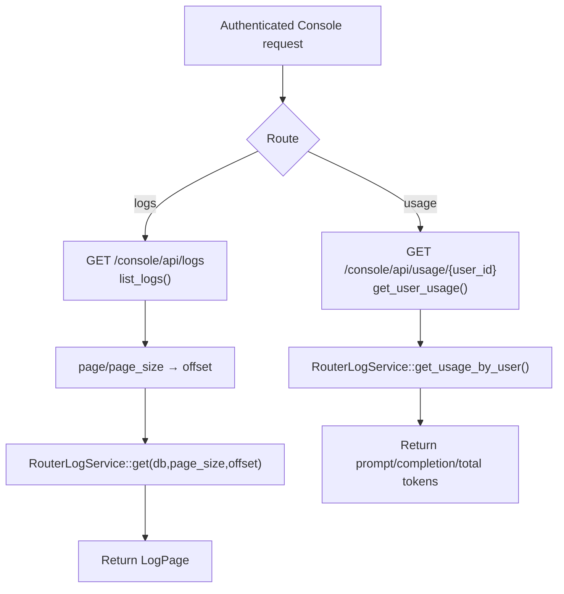

# View Logs & User Usage

← [Console 管理](/#/console/)

## ICFG

## Source Evidence

- [`crates/server/src/api/log.rs:L44-L98`](https://github.com/burncloud/burncloud/blob/main/crates/server/src/api/log.rs#L44-L98)
