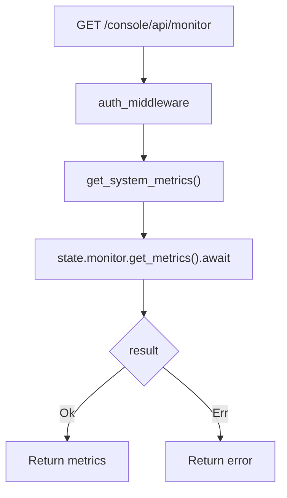

# View System Monitor

← [Console 管理](/console/)

## ICFG

## Source Evidence

- [`crates/server/src/api/monitor.rs:L5-L15`](https://github.com/burncloud/burncloud/blob/main/crates/server/src/api/monitor.rs#L5-L15)
