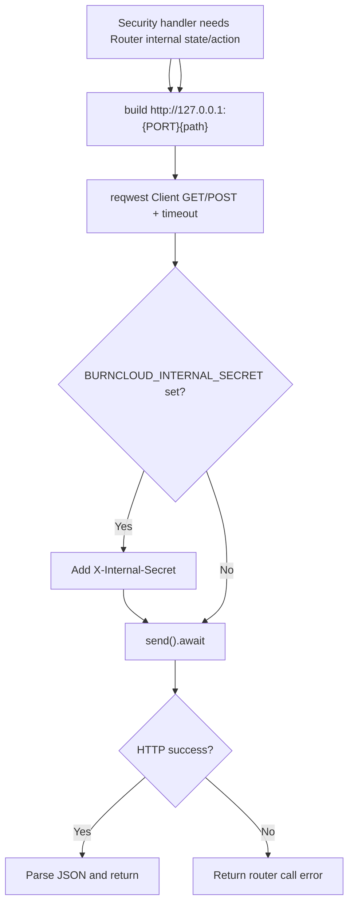

# Security Monitor Actions

← [Console 管理](/console/)

## What happens here?

Security routes include summary/events/filter configuration plus emergency circuit-break action. Some handlers call Router internal HTTP endpoints through loopback `127.0.0.1:{PORT}` and optionally attach `X-Internal-Secret`; therefore the Console Security layer can trigger an internal Router operation through a real HTTP hop rather than a direct Rust function call.

## ICFG — Internal Router Call Helper

## Source Evidence

- Routes: [`crates/server/src/api/security.rs:L95-L113`](https://github.com/burncloud/burncloud/blob/main/crates/server/src/api/security.rs#L95-L113)
- Internal GET helper: [`crates/server/src/api/security.rs:L117-L146`](https://github.com/burncloud/burncloud/blob/main/crates/server/src/api/security.rs#L117-L146)
- Internal POST helper: [`crates/server/src/api/security.rs:L148-L183`](https://github.com/burncloud/burncloud/blob/main/crates/server/src/api/security.rs#L148-L183)

**Confidence: HIGH — STATIC CONFIRMED**
