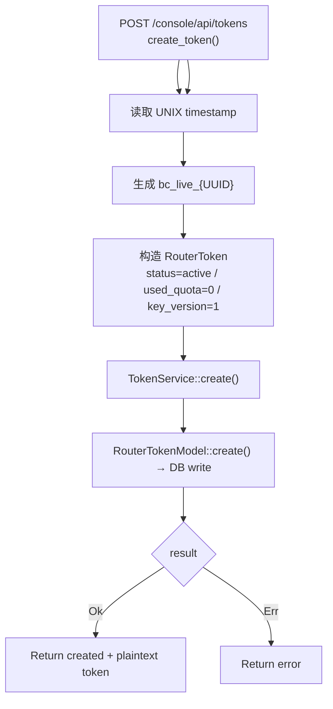

# Create API Token

← [API Token Management](/console/token-management/)

## ICFG

## State / Side Effects

- DB WRITE: new router token row.
- Response returns generated plaintext token.

## Source Evidence

- [`crates/server/src/api/token.rs:L73-L122`](https://github.com/burncloud/burncloud/blob/main/crates/server/src/api/token.rs#L73-L122)
- [`crates/service/crates/token/src/lib.rs:L22-L25`](https://github.com/burncloud/burncloud/blob/main/crates/service/crates/token/src/lib.rs#L22-L25)
