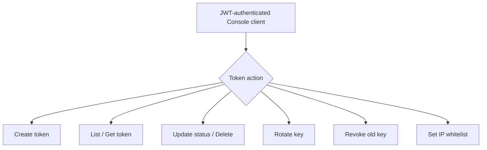

# API Token Management

← [Console 管理](/#/console/)

## User Flow

## Entry Routes

`/console/api/tokens` and `/console/api/tokens/{token}` plus rotate/revoke-old/ip-whitelist child routes.

## Source Evidence

- [`crates/server/src/api/token.rs:L40-L56`](https://github.com/burncloud/burncloud/blob/main/crates/server/src/api/token.rs#L40-L56)
