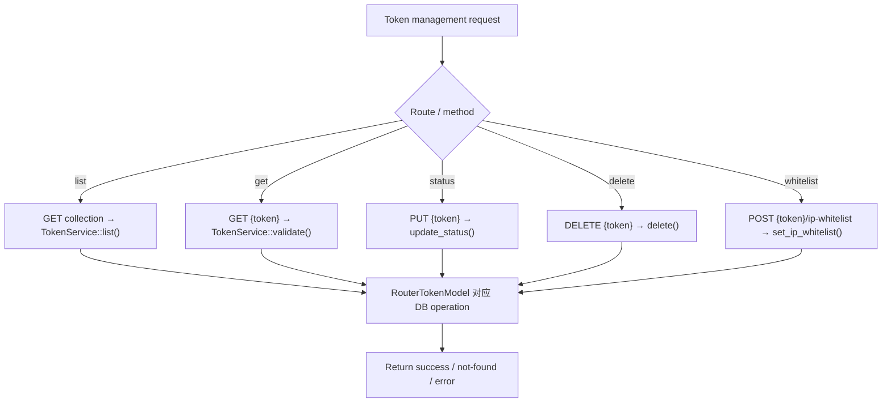

# List / Get / Status / Delete / IP Whitelist

← [API Token Management](/#/console/token-management/)

## ICFG

## State / Side Effects

- List/Get: DB reads.
- Update/Delete/IP whitelist: DB mutations.

## Source Evidence

- Routes and handlers: [`crates/server/src/api/token.rs:L40-L260`](https://github.com/burncloud/burncloud/blob/main/crates/server/src/api/token.rs#L40-L260)
- Service mapping: [`crates/service/crates/token/src/lib.rs:L16-L102`](https://github.com/burncloud/burncloud/blob/main/crates/service/crates/token/src/lib.rs#L16-L102)
