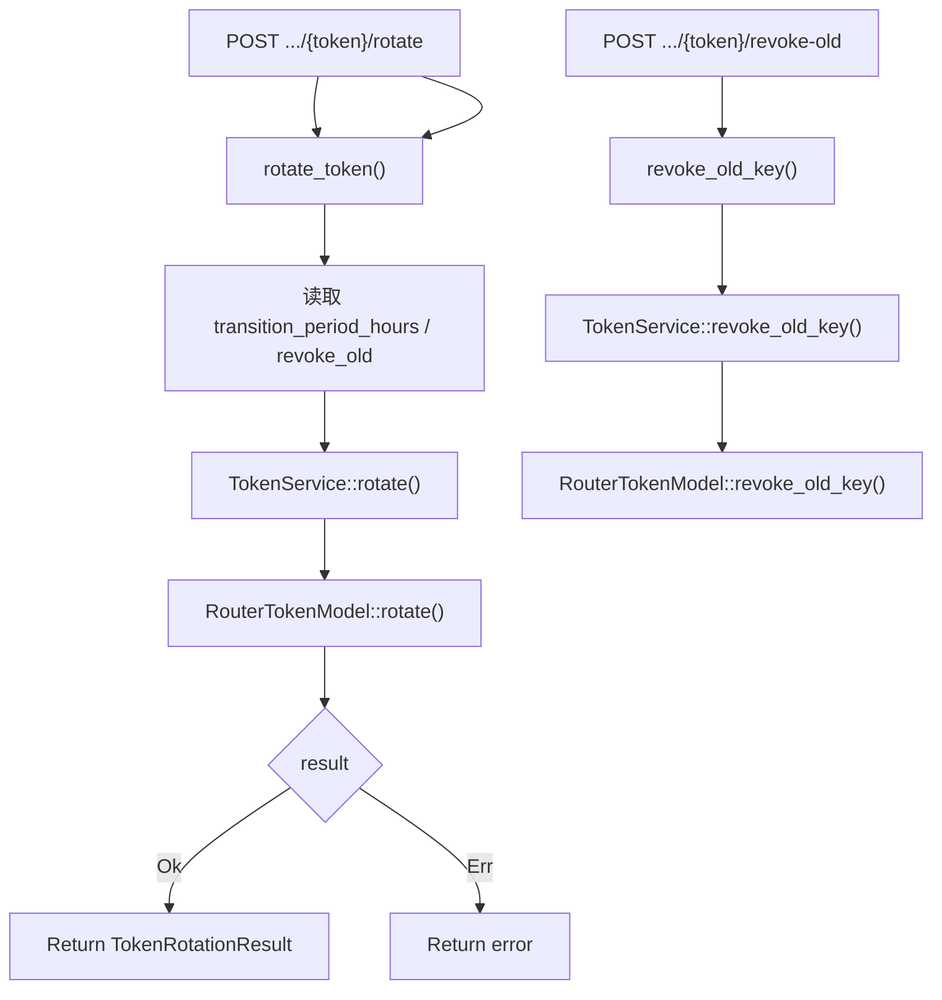

# Rotate / Revoke Old Token Key

← [API Token Management](/#/console/token-management/)

## What happens here?

rotate handler 把当前 token、transition hours 与 `revoke_old` 交给 `TokenService::rotate()`，真正 rotation semantics 在 `RouterTokenModel::rotate()`。单独的 revoke-old route 则直接调用 `revoke_old_key()`。

## ICFG

## Source Evidence

- Rotate handler: [`crates/server/src/api/token.rs:L192-L225`](https://github.com/burncloud/burncloud/blob/main/crates/server/src/api/token.rs#L192-L225)
- Revoke handler: [`crates/server/src/api/token.rs:L227-L251`](https://github.com/burncloud/burncloud/blob/main/crates/server/src/api/token.rs#L227-L251)
- Service dispatch: [`crates/service/crates/token/src/lib.rs:L68-L96`](https://github.com/burncloud/burncloud/blob/main/crates/service/crates/token/src/lib.rs#L68-L96)

**Confidence: HIGH for handler→service→DB model dispatch.**
