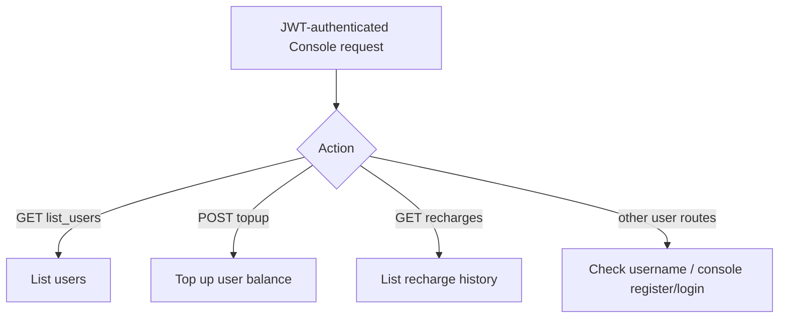

# User & Balance Management

← [Console 管理](/#/console/)

## User Flow

注意：这些 `user::routes()` 被 merge 到 protected router，因此即使 path 名称包含 `register/login`，在当前组合方式下也会经过 Console `auth_middleware`。

## Source Evidence

- Route definitions: [`crates/server/src/api/user.rs:L67-L78`](https://github.com/burncloud/burncloud/blob/main/crates/server/src/api/user.rs#L67-L78)
- Protected merge: [`crates/server/src/api/mod.rs:L18-L55`](https://github.com/burncloud/burncloud/blob/main/crates/server/src/api/mod.rs#L18-L55)
