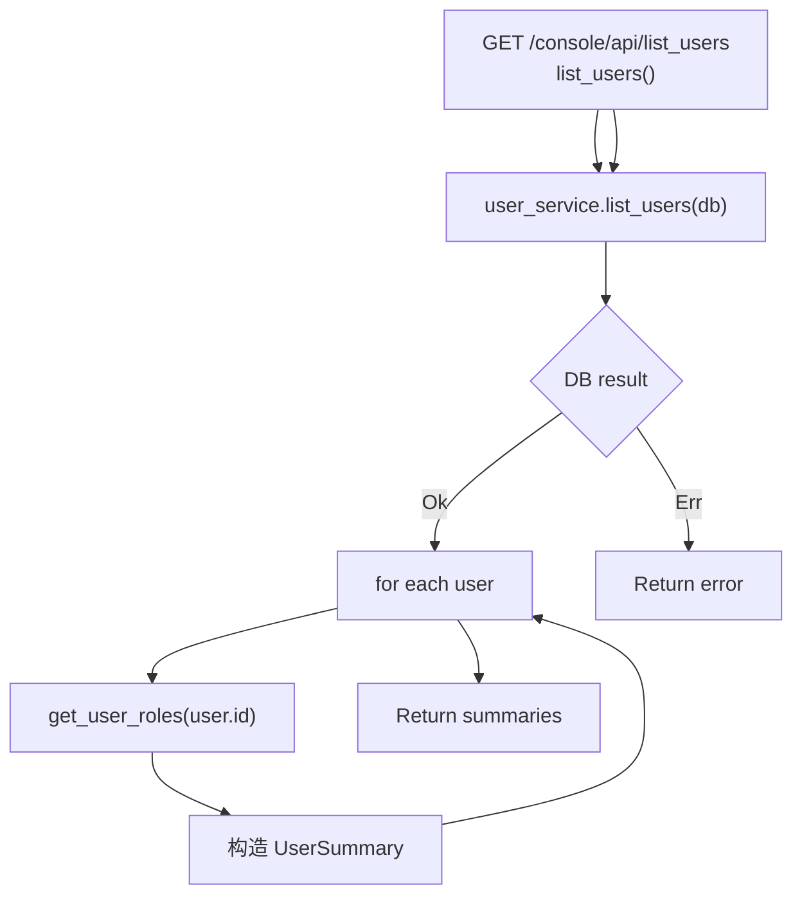

# List Users

← [User & Balance Management](/console/user-management/)

## ICFG

## State / Side Effects

- DB READ: all users + per-user roles.

## Source Evidence

- [`crates/server/src/api/user.rs:L163-L205`](https://github.com/burncloud/burncloud/blob/main/crates/server/src/api/user.rs#L163-L205)
- UserService list/get roles: [`crates/service/crates/user/src/lib.rs:L312-L328`](https://github.com/burncloud/burncloud/blob/main/crates/service/crates/user/src/lib.rs#L312-L328)
