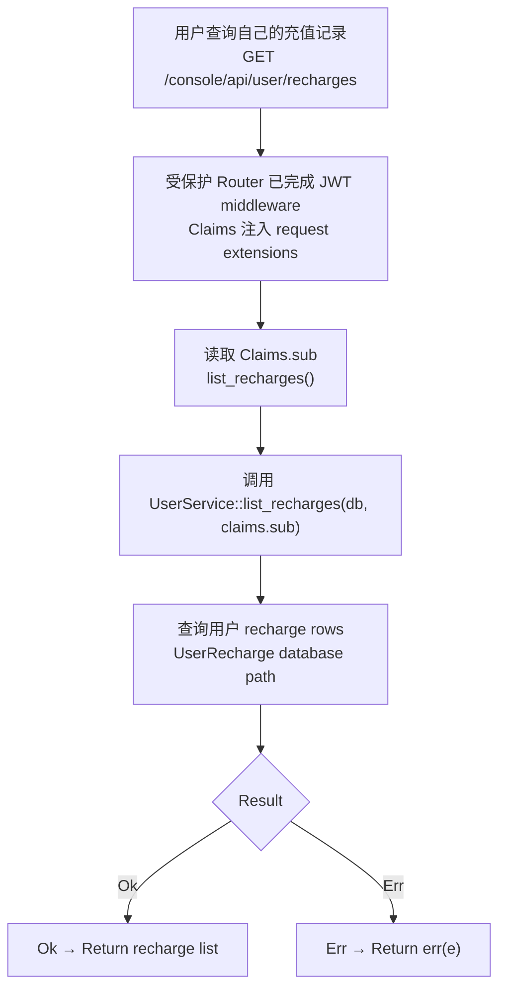

# Recharge History

← [User & Balance Management](/console/user-management/)

## What happens here?

该 Console route 位于受 `auth_middleware` 保护的 router 中，因此 handler 可从 Axum request extensions 获得 `Claims`。`list_recharges()` 直接使用 `claims.sub` 作为 user id，调用 `UserService::list_recharges()`，再进入数据库层读取该用户的 recharge history；成功返回列表，失败走统一 `err(e)` response。

## ICFG

## State / Side Effects

- **DB READ:** recharge history for authenticated `claims.sub`.
- No write is visible on this GET path.

## Source Evidence

- Route group: [`crates/server/src/api/user.rs:L67-L78`](https://github.com/burncloud/burncloud/blob/main/crates/server/src/api/user.rs#L67-L78)
- Handler and exact user-id source: [`crates/server/src/api/user.rs:L250-L262`](https://github.com/burncloud/burncloud/blob/main/crates/server/src/api/user.rs#L250-L262)
- Service: [`crates/service/crates/user/src/lib.rs:L357-L362`](https://github.com/burncloud/burncloud/blob/main/crates/service/crates/user/src/lib.rs#L357-L362)
- Database: [`crates/database/crates/user/src/lib.rs:L504-L510`](https://github.com/burncloud/burncloud/blob/main/crates/database/crates/user/src/lib.rs#L504-L510)

**Confidence: HIGH — STATIC CONFIRMED.**
