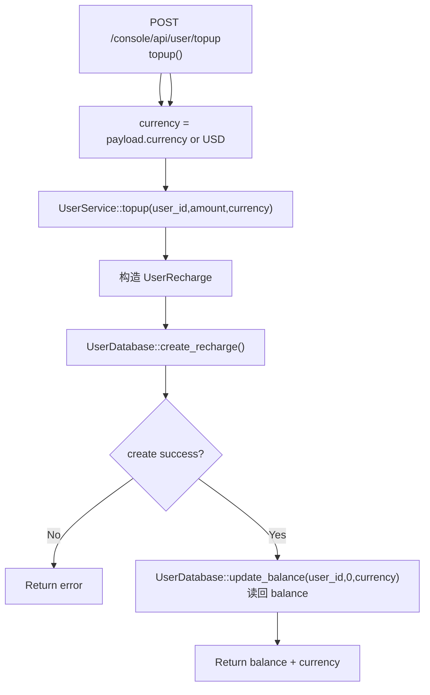

# Top Up User Balance

← [User & Balance Management](/#/console/user-management/)

## What happens here?

handler 默认 currency=USD 后调用 `UserService::topup()`。service 创建 recharge 记录；注释明确 `create_recharge` 已经更新 balance，随后用 `update_balance(..., 0, currency)` 读回当前余额并返回。

## ICFG

## State / Side Effects

- DB WRITE: recharge record and balance update performed by DB layer.
- DB READ/refresh: return current balance.

## Source Evidence

- Handler: [`crates/server/src/api/user.rs:L48-L65`](https://github.com/burncloud/burncloud/blob/main/crates/server/src/api/user.rs#L48-L65)
- Service: [`crates/service/crates/user/src/lib.rs:L330-L355`](https://github.com/burncloud/burncloud/blob/main/crates/service/crates/user/src/lib.rs#L330-L355)
