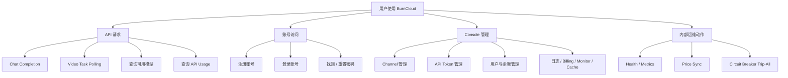

# BurnCloud Runtime Flow & ICFG Atlas

本 Atlas **只从用户行为开始**。左侧菜单不是 crate / module / file tree，而是用户可以触发的执行流程。

## User Execution Tree

## Reading Rule

从左侧选一个用户动作：

**User Action → End-to-End Flow → Drill-down ICFG → 更小的 ICFG → Source Evidence**。

图中出现 **⚠ Dynamic** 时，表示具体实现由运行时配置 / trait object 决定，Atlas 不把它画成静态确定路径。
