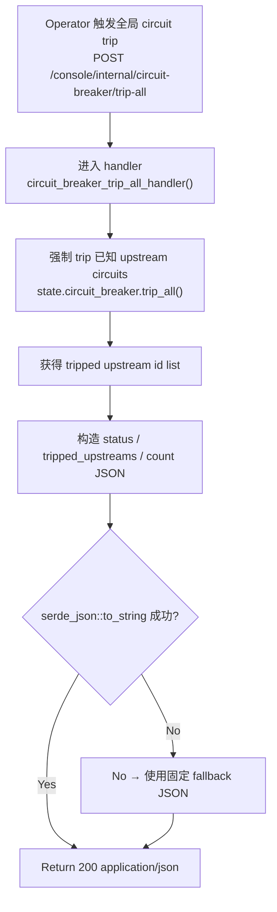

# Trip All Circuit Breakers

← [Internal Operator Actions](/operator/)

## What happens here?

这个 internal endpoint 是一个紧急 operator action。`circuit_breaker_trip_all_handler()` 调用 `state.circuit_breaker.trip_all()`，把该组件已知的 upstream circuits 强制置为 Open，并取得被 trip 的 upstream id 列表；handler 随后返回 status、列表与 count 的 JSON。

## ICFG

## State / Side Effects

- **STATE WRITE:** mutates in-memory circuit breaker state for known upstreams.
- Response exposes tripped IDs and count.

## Source Evidence

- Internal route registration: [`crates/router/src/lib.rs:L937-L952`](https://github.com/burncloud/burncloud/blob/main/crates/router/src/lib.rs#L937-L952)
- Handler body: [`crates/router/src/lib.rs:L1019-L1039`](https://github.com/burncloud/burncloud/blob/main/crates/router/src/lib.rs#L1019-L1039)

**Confidence: HIGH — STATIC CONFIRMED.**
