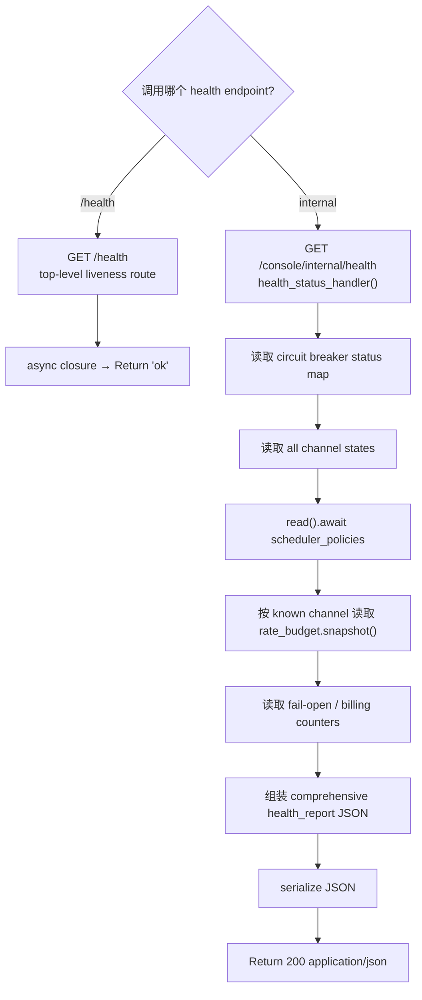

# Health Checks

← [Internal Operator Actions](/#/operator/)

## What happens here?

BurnCloud 有两个不同深度的 health user flow。顶层 `/health` 是未认证 liveness probe，只返回文本 `ok`。`/console/internal/health` 进入 `health_status_handler()`，读取 circuit breaker 状态、channel state、scheduler policies、rate-budget snapshots 和若干 billing/fail-open counters，并组装 JSON report。

## ICFG

## State / Side Effects

- Top-level liveness has no visible state mutation.
- Internal health reads in-memory router state/policies/budgets/counters; no DB write is visible in this handler.

## Source Evidence

- Top-level liveness route: [`crates/server/src/lib.rs:L59-L68`](https://github.com/burncloud/burncloud/blob/main/crates/server/src/lib.rs#L59-L68)
- Internal route binding: [`crates/router/src/lib.rs:L937-L952`](https://github.com/burncloud/burncloud/blob/main/crates/router/src/lib.rs#L937-L952)
- Rich handler: [`crates/router/src/lib.rs:L1263-L1357`](https://github.com/burncloud/burncloud/blob/main/crates/router/src/lib.rs#L1263-L1357)

**Confidence: HIGH — STATIC CONFIRMED.**
